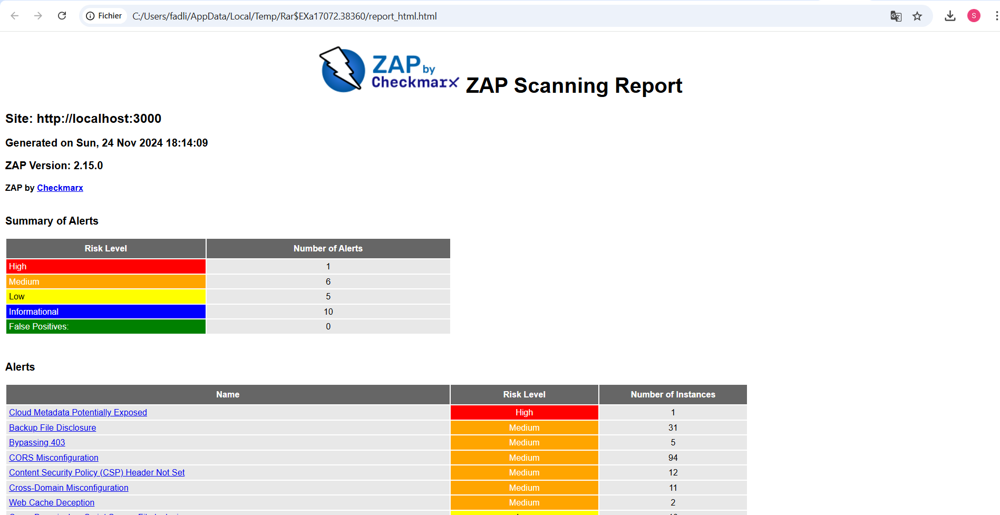

# DevSecOps CI/CD Pipeline for OWASP Juice Shop

## Overview
This repository contains a **DevSecOps CI/CD pipeline** designed to secure and automate the deployment process for the **OWASP Juice Shop** application. The pipeline includes multiple security testing layers and is fully integrated with GitHub Actions to ensure that every change made to the Juice Shop codebase undergoes static, dynamic, and dependency security testing.

The pipeline will:
- **Static Application Security Testing (SAST)**: Run CodeQL analysis on the application's source code.
- **Software Composition Analysis (SCA)**: Use Snyk to scan for vulnerabilities in dependencies.
- **Dynamic Application Security Testing (DAST)**: Perform a security scan using OWASP ZAP on the running application.
- **Automatic Deployment**: Deploy the updated Juice Shop application once the pipeline passes all security tests.

---

## CI/CD Pipeline Workflow

### Trigger
The pipeline is triggered automatically whenever changes are pushed to the `master` branch.

### Jobs in the Pipeline
The pipeline consists of the following jobs:

1. **Build**
   - Sets up Docker and pulls the official Juice Shop Docker image.
   
2. **Security Testing**
   - **Static Application Security Testing (SAST)**: Uses CodeQL to analyze the codebase for vulnerabilities.
   - **Software Composition Analysis (SCA)**: Uses Snyk to identify any known vulnerabilities in the application dependencies.
   - **Dynamic Application Security Testing (DAST)**: Runs an OWASP ZAP scan on a running instance of the Juice Shop application.

3. **Deploy**
   - Deploys the updated Juice Shop application once the security tests pass.

### Security Testing Details
- **CodeQL (SAST)**: Performs static code analysis for vulnerabilities.
- **Snyk (SCA)**: Checks for vulnerabilities in open-source dependencies.
- **OWASP ZAP (DAST)**: Scans the live application for runtime security issues.

## ZAP Scan Results
Below is a sample report generated by the OWASP ZAP security scan performed on the deployed instance of Juice Shop:

### Deployment
The pipeline deploys the Juice Shop application after the security tests complete successfully. This is done by running a Docker container with the latest image built from the repository.